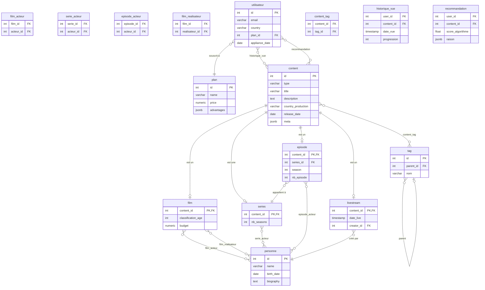

```mermaid
erDiagram
    content {
        int id PK
        varchar type
        varchar title
        text description
        varchar country_production
        date release_date
        jsonb meta
    }

    film {
        int content_id PK,FK
        int classification_age
        numeric budget
    }

    series {
        int content_id PK,FK
        int nb_seasons
    }

    episode {
        int content_id PK,FK
        int series_id FK
        int season
        int nb_episode
    }

    livestream {
        int content_id PK,FK
        timestamp date_live
        int creator_id FK
    }

    personne {
        int id PK
        varchar name
        date birth_date
        text biography
    }

    film_acteur {
        int film_id FK
        int acteur_id FK
    }

    serie_acteur {
        int serie_id FK
        int acteur_id FK
    }

    episode_acteur {
        int episode_id FK
        int acteur_id FK
    }

    film_realisateur {
        int film_id FK
        int realisateur_id FK
    }

    plan {
        int id PK
        varchar name
        numeric price
        jsonb advantages
    }

    utilisateur {
        int id PK
        varchar email
        varchar country
        int plan_id FK
        date appliance_date
    }

    tag {
        int id PK
        int parent_id FK
        varchar nom
    }

    content_tag {
        int content_id FK
        int tag_id FK
    }

    historique_vue {
        int user_id FK
        int content_id FK
        timestamp date_vue
        int progression
    }

    recommandation {
        int user_id FK
        int content_id FK
        float score_algorithme
        jsonb raison
    }

    content ||--o| film : "est un"
    content ||--o| series : "est une"
    content ||--o| episode : "est un"
    content ||--o| livestream : "est un"

    episode }o--|| series : "appartient à"
    livestream }o--|| personne : "créé par"

    film }o--o{ personne : "film_acteur"
    series }o--o{ personne : "serie_acteur"
    episode }o--o{ personne : "episode_acteur"
    film }o--o{ personne : "film_realisateur"

    utilisateur }o--|| plan : "souscrit à"

    content }o--o{ tag : "content_tag"
    tag }o--o| tag : "parent"

    utilisateur }o--o{ content : "historique_vue"
    utilisateur }o--o{ content : "recommandation"
```
